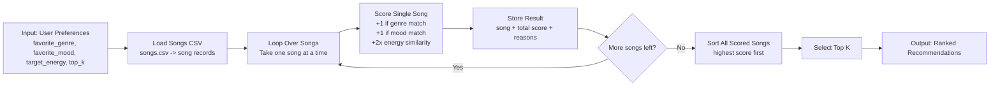
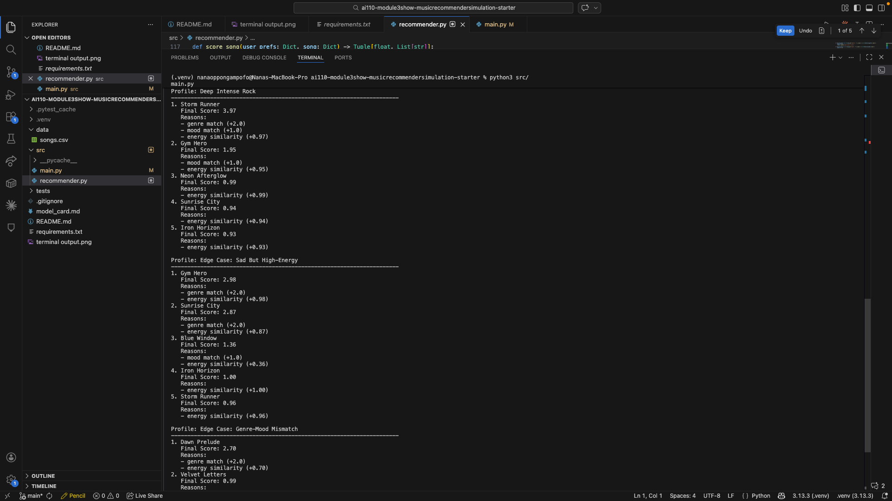

# 🎵 Music Recommender Simulation

## Project Summary

In this project, I built a simple music recommender that ranks songs from a small catalog. It compares a user profile to each song and scores matches based on genre, mood, and energy closeness. I tested several user profiles, including edge cases, to see what felt accurate and what felt unexpected.

---

## How the System Works

Real recommender systems use lots of signals. My version keeps things simple so it is easy to understand and explain.

Data flow map (Input -> Process -> Output):



Algorithm recipe (finalized):

- Genre match: `+1.0`
- Mood match: `+1.0`
- Energy contribution: `2 * max(0, 1 - abs(song.energy - target_energy))`

Total score:

`score = genre_points + mood_points + (2 * energy_similarity)`

Potential bias note:

- If one weight is too strong, results can lean too much on that single signal.
- A small song catalog means less variety in the top results.
- Songs that do not match common profile patterns can get pushed down.

---

## Getting Started

### Setup

1. Create a virtual environment (optional):

```bash
python -m venv .venv
source .venv/bin/activate      # Mac or Linux
.venv\Scripts\activate         # Windows
```

2. Install dependencies:

```bash
pip install -r requirements.txt
```

3. Run the app:

```bash
python -m src.main
```

### CLI Verification Output

Terminal output showing recommended songs, final scores, and scoring reasons:


### Stress Test Profile Screenshots

Screenshots of terminal recommendation output for each profile run:

#### Profile Screenshot: High-Energy Pop



#### Profile Screenshot: Chill Lofi


#### Profile Screenshot: Deep Intense Rock


### Running Tests

Run tests with:

```bash
pytest
```

---

## Experiments You Tried

I ran a weight-shift experiment to see how sensitive the system is:

- Baseline: genre `+2.0`, mood `+1.0`, energy similarity `x1`
- Experiment: genre `+1.0`, mood `+1.0`, energy similarity `x2`

After this change, recommendations became more energy-focused. Some #1 songs stayed the same, but lower-ranked songs shifted toward tracks with closer energy.

---

## Limitations and Risks

The dataset is small, so some profiles do not get much variety. The current scoring can create a filter-bubble effect when one signal dominates. The model also ignores lyrics and listening context.

---

## Reflection

The full reflection and evaluation are in [model_card.md](model_card.md). My biggest takeaway is that even simple scoring rules can feel personal, but small weight changes can also cause repeated patterns and bias.
